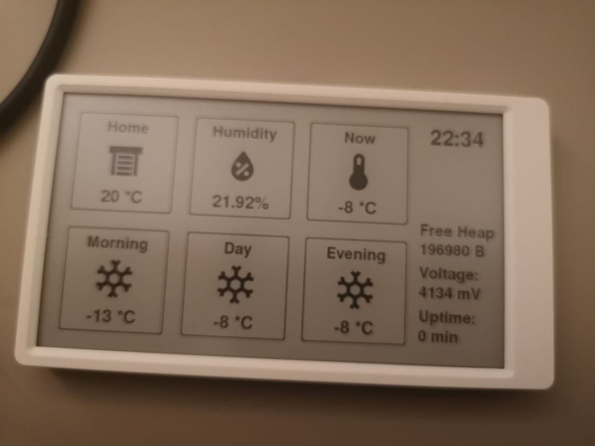

# M5Paper Weather Station

Based on https://github.com/cyrilpawelko/m5panel

Displays weather from openweathermap.org.

## Configuration

See https://github.com/cyrilpawelko/m5panel 
for detailed configuration.

After that, create src/defs.h with WIFI, TIMEZONE and weather URL

## Configuring weather URL

See https://openweathermap.org/api/one-call-api for more information. You need coordinates for the point to get weather information about. Detect your location by opening map website, for example https://www.openstreetmap.org. 

